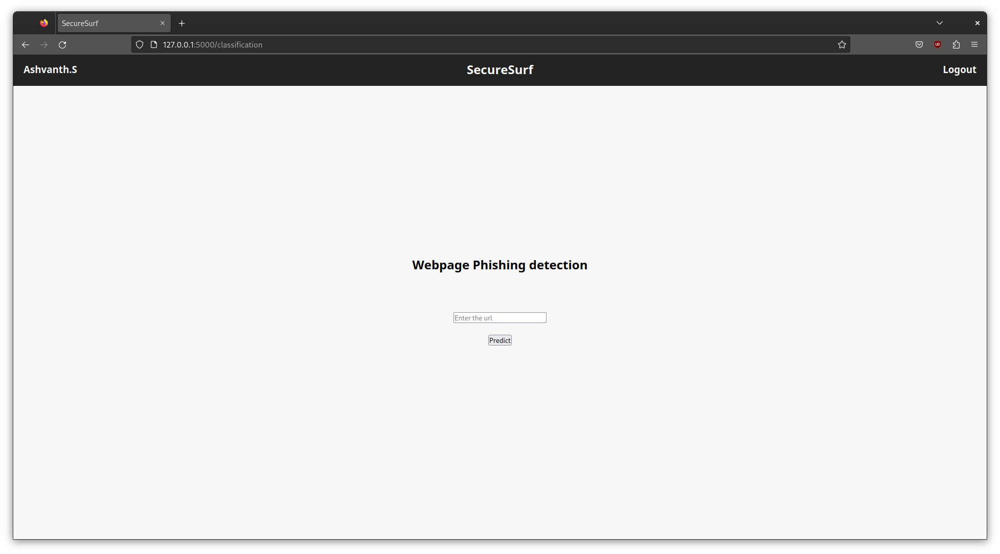

# SecureSurf

SecureSurf is an application designed to address the security challenges posed by the growth of increasing use of internet. 

The primary challenges faced by online consumers are related to cyberfraud and identity theft. To combat these issues, SecureSurf focuses on checking the legitimacy of visited web pages, which is crucial in safeguarding customers' identities and preventing phishing attacks.

By verifying the legitimacy of websites, SecureSurf helps ensure a secure and safe browsing experience for users.

### Requirements:

```
flask
pandas
numpy
sckit-learn
```

### Application:

**Login Page**


**Home Page**


**Detection Page**



### Use:
- Clone the repository
```
git clone https://github.com/ash-01xor/SecureSurf
```
- Move to folder Flask via terminal
```
cd Flask
```
- Run Flask
```
flask run
```